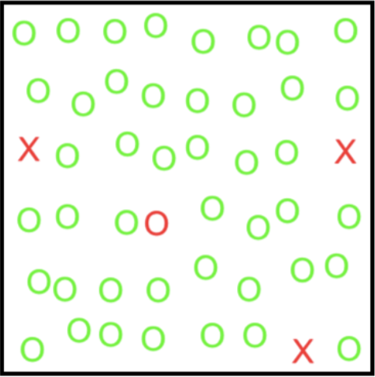
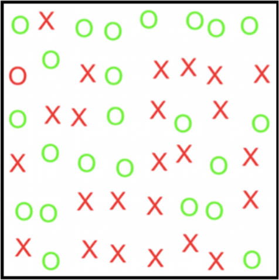
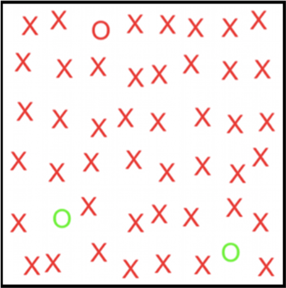

# DR-Task-A3C-Pytorch
When people search for a target in a novel image they often make use of eye movements to bring the relatively high acuity fovea to bear on areas of interest. The strategies that control these eye movements for visual search have been of substantial scientific interest. In this project we presented a new computational model that shows how strategies for visual search are an emergent consequence of perceptual/motor constraints and approximately optimal strategies. The model solves a Partially Observable Markov Decision Process (POMDP) using deep reinforcement learning to acquire strategies that optimise the tradeoff between speed and accuracy.

# Task
In the distractor ratio task the  display  consists of a target object, which is randomly positioned amongst  distractor objects each of which shares at least one common feature with the target. The goal is to respond whether the target is present or absent. An example display is shown in images below where the target is a red letter O. The distractors in this display share either a same-colour or same-shape feature with the target.
 

# Quickstart
1. Run the DataGeneration.ipynb notebook first to generate data samples that will be used to train the model.
2. Next run the DR_CNN_Model_2.ipynb notebook to train the CNN network. This model converts raw images to symbolic scores for each location that will then be used by the reinforcement learner.
3. Finally run the A3C_Pytorch.ipynb notebook, this is the reinforcment controller that learn to control eye movements.
